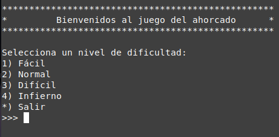
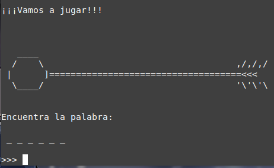
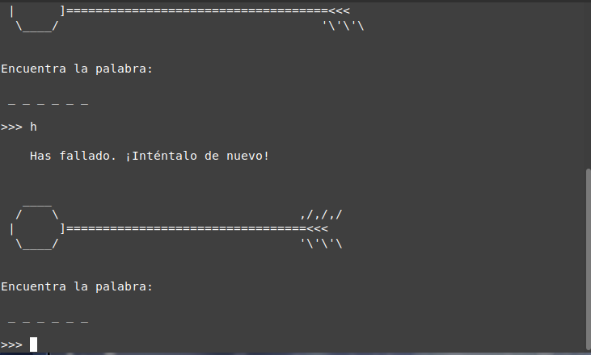
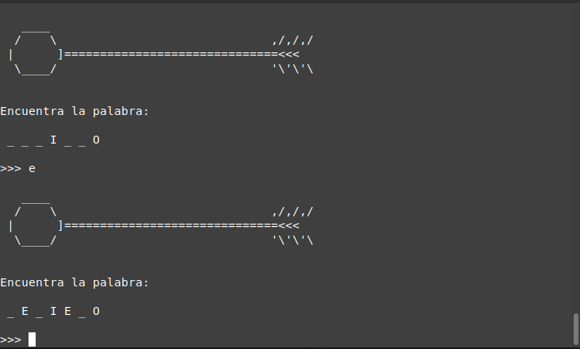
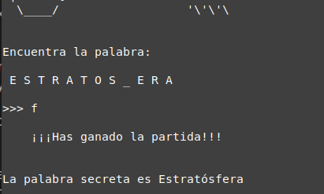

# El_Ahorcado_juego

Clásico juego del ahorcado. El juego consiste en adivinar una palabra, letra por letra, contando con un número fijo de intentos fallidos. Cuando los fallos acumulan un cierto número dado por la dificultad elegida, el jugador perderá el juego.

Como en el juego clásico, los fallos se caracterizan usando un dibujo, normalmente el dibujo de un personaje en la horca. El dibujo comienza por la cabeza, y a cada fallo, el personaje va tomando forma; el juego termina cuando se han dibujado tanto brazos y piernas del personaje.

No obstante, este proyecto gira en torno a una variación del juego: el uso de una bomba a punto de estallar. A cada intento fallido, la mecha se irá acortando, y el juego terminará cuando la chispa alcance la bomba y estalle.

## Requerimientos

El proyecto se realizó usando **Python 3.8.10**, y los siguientes módulos:

* [**Pandas 1.4.3**](https://pandas.pydata.org/docs/index.html): Para el manejo de la base de datos que contiene las palabras.

Pandas requiere instalación externa:

> ```bash
>pip install pandas
> ```

## ¿Cómo jugar?

El proyecto está pensado para terminal. El juego debe arrancar desde el archivo `main.py`. Abriendo una terminal en el directorio del proyecto ejecutamos

> ```bash
> python main.py
> ```

o desde algunas distribuciones de Linux

> ```bash
> python3 main.py
> ```

El primer paso para jugar consiste en elegir el nivel del juego. La diferencia entre niveles radica en el número de fallos disponibles —el número exacto queda a experiencia del jugador.



De esta forma, el juego comenzará. Se mostrará en pantalla una bomba con una mecha encendida, y a continuación varios espacios vacíos que representan la palabra secreta; los espacios coinciden con el número de letras que tiene la palabra.



Por cada fallo se mostrará un mensaje indicando el error, y la mecha de la bomba se acortará por un tramo.



Sí hay un acierto, todas las apariciones de la letra en la palabra serán reveladas.



Una vez que la palabra sea adivinada, el juego terminará.



### Consideraciones

* El juego solo trata de adivinar las letras que contiene la palabra secreta, usando el alfabeto en español. Por ende, **las palabras secretas jamás contendrán números o caracteres especiales**. No obstante, **un intento usando estos caracteres se considerará un fallo**.
* **El juego funciona igualmente usando letras mayúsculas o minúsculas**. Es decir, jugar con 'A' será equivalente que jugar con 'a'.
* **Las palabras secretas se adivinan sin usar acentos**. Es decir, si la palabra secreta es 'adivinación', esta se jugará como 'adivinacion'. Es decir, que jugar con un 'ó' se considerará un fallo; 'ó' $\neq$ 'o'. Al final del juego, la palabra se mostrará con la acentuación adecuada.

## Próximas implementaciones

El proyecto ya es funcional, no obstante aún no está completo. A continuación enumero las implementaciones que se harán para futuras versiones:

* Dar una opción para volver a jugar: Por el momento el programa termina abruptamente cuando el jugador gana o pierde.
* Obtener una base de datos más grande y más variada: De preferencia se requeriría una API con palabras y frases (nombres propios, impropios o refranes), y asociar a cada una un nivel de dificultad para usarla de forma más adecuada en el juego.
* Dar una opción para cambiar el diseño: Por el momento se usa una bomba, pero el proyecto permite usar otros modelos. Se diseñará algunos y se dará al usuario la oportunidad de elegir el que más le guste.